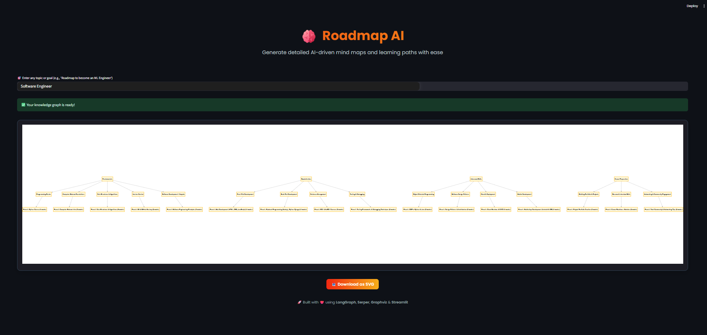
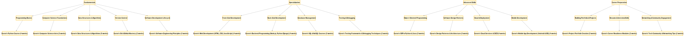

# Roadmap.ai

> **Your AI-powered guide to navigating careers, one step at a time.**

Roadmap.ai is a GenAI-based career guidance tool that leverages autonomous agents, web search, summarization, and flowchart visualization to generate complete learning roadmaps based on user queries.
Whether you're a beginner or transitioning careers, Roadmap.ai simplifies your journey using LLMs and intelligent orchestration.

---

##Features

- **Web-augmented AI** – Uses real-time web search to retrieve up-to-date content.
- **Autonomous LangGraph Agents** – Specialized agents that handle search, summarization, and graph creation.
- **LLM-Powered Summarization** – Condenses complex articles and topics into concise steps.
- 🗺**Graph Visualization** – Outputs your personalized roadmap in a visual flowchart using Graphviz.
- **Sequential Workflow** – Powered by LangGraph to maintain modularity and explainability.

---

## 🛠️ Tech Stack

- **Frontend**: Streamlit
- **LLM Orchestration**: LangGraph (built on top of LangChain)
- **Web Search**: Serper API (Google Search abstraction)
- **Visualization**: Graphviz
- **Language Model**: OpenAI GPT
- **Environment Config**: dotenv

---

## 📸 Demo

### 🟦 Home Page


### 🟩 AI-Generated Career Roadmap



---

## ⚙️ How It Works

1. **User Input**  
   → e.g., *"I want to become a prompt engineer"*

2. **Search Agent**  
   → Performs a Serper API-based Google search for relevant learning content.

3. **Summarizer Agent**  
   → Summarizes long articles using an LLM into digestible steps.

4. **Graph Agent**  
   → Builds a flowchart from the summarized steps.

5. **Display**  
   → Shows the generated roadmap graph in Streamlit UI.

---

## 🧪 Setup & Installation

```bash
git clone https://github.com/PixelPioneer1807/Roadmap.ai.git
cd Roadmap.ai
cd knowledge_graph_builder
create a virtual env, Add your API keys in a .gitgnore file in tools folder
pip install -r requirements.txt
cd ..
streamlit run app.py

